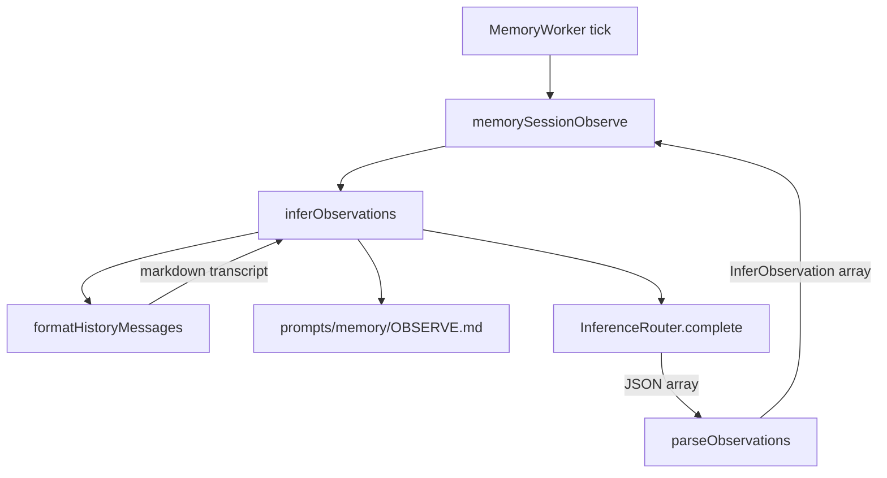

# Memory inference

Extracts observations from conversation history via LLM inference.

## Architecture

## Files

| File | Purpose |
|------|---------|
| `engine/memory/infer/inferObservations.ts` | Runs inference to extract observations from history |
| `engine/memory/infer/utils/formatHistoryMessages.ts` | Converts `AgentHistoryRecord[]` to markdown transcript |
| `prompts/memory/OBSERVE.md` | System prompt for the observation extraction model |

## Flow

1. `MemoryWorker` polls for invalidated sessions
2. For each session, resolves providers via `listActiveInferenceProviders`
3. Calls `memorySessionObserve` with records and inference deps
4. `inferObservations` formats history into markdown via `formatHistoryMessages`
5. Sends transcript + OBSERVE prompt to a normal-sized model via `InferenceRouter`
6. Parses the JSON response into `InferObservation[]` (graceful fallback to empty on parse failure)
