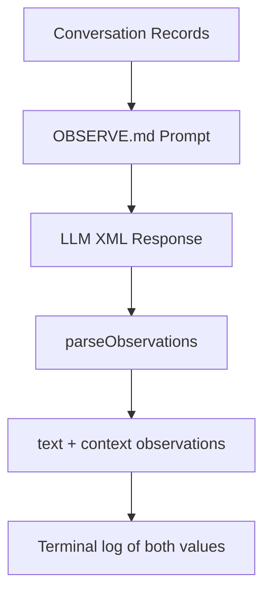

# Memory Observation Text + Context

## Summary
Memory observation inference extracts people-focused observations from conversations. Each observation captures:
- `text`: a human intent, action, preference, outcome, or lesson learned
- `context`: a detailed narrative of the conversation situation that makes the observation meaningful

Observations focus on the person — their goals, reactions, preferences, and experiences — rather than technical implementation details. Tool failures and recoveries are described in plain language so they can inform future interactions.

## Inference Flow


## XML Contract
```xml
<observations>
<observation>
<text>The person asked to generate a playful birthday card for their friend, preferring hand-drawn style with warm colors</text>
<context>The person was preparing for a friend's birthday and wanted something personal. They liked dogs and humor, so the card featured a cartoon dog in a party hat. They were happy with the result.</context>
</observation>
</observations>
```
