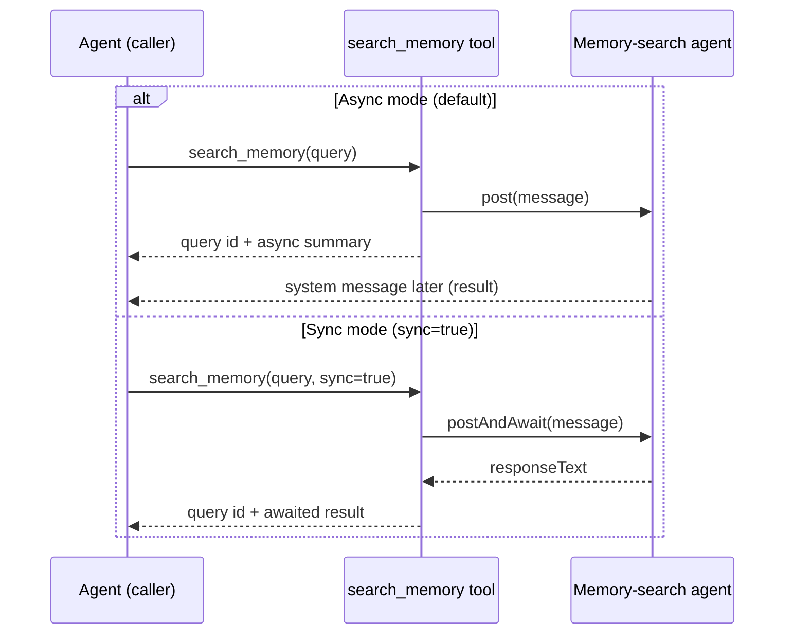

# `search_memory` Sync Mode

## Summary

`search_memory` now supports an optional `sync` boolean parameter:

- `sync` omitted or `false`: returns immediately with a query id (async mode).
- `sync=true`: waits for memory-search completion and returns the synthesized answer in the tool result (sync mode).

Background agents should prefer `sync=true` so they can use memory results in the same execution step.

## Flow

