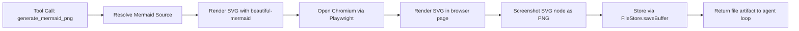

# Mermaid PNG Tool

Daycare provides a built-in tool named `generate_mermaid_png` for agents to render Mermaid diagrams into PNG files.

## Parameters

- `mermaid` (required): Raw Mermaid source string (no markdown fences).
- `name` (optional): Output file name. `.png` is appended if missing.
- `theme` (optional): Mermaid theme name from `beautiful-mermaid` (default: `github-light`).
- `width` (optional): Output image width in pixels, range `256..4096` (default: `1600`).

## Result

The tool stores the generated PNG in the file store and returns it as a generated file artifact so connectors can send it to users.
PNG rendering is done by opening a headless Chromium page through Playwright and taking a screenshot of the rendered SVG.

## Flow

