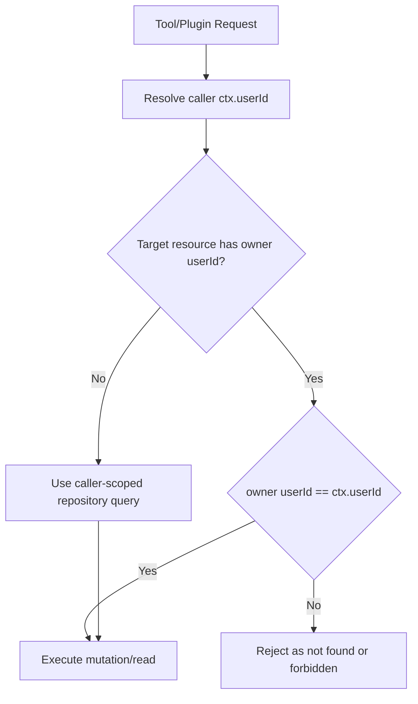

# Strict Multitenant Tool Scoping Hardening

Date: 2026-02-25

## Goal

Enforce strict user scoping (`ctx.userId`) across tool and plugin execution paths so one tenant cannot read, mutate, or control another tenant's runtime state.

## Enforced Guard Pattern

## Surfaces Hardened

- `topology`
  - Channel inventory now uses `channels.listForUserIds(visibleUserIds)` instead of global channel list behavior.
- Channel facade + tools
  - `channels.create/send/getHistory` now require caller `ctx` and enforce `ctx.userId` ownership.
  - Member add/remove tooling blocks cross-user target `agentId` resolution.
- Expose tools
  - `expose_list` reads scoped data via `storage.exposeEndpoints.findMany(ctx)`.
  - `expose_update` and `expose_remove` verify endpoint ownership before mutation.
- Signal tools
  - `signal_events_csv` now reads caller-scoped events only.
  - `signal_subscribe` / `signal_unsubscribe` reject target agents outside caller user scope.
- Process tooling/facade
  - Added `Processes.listForContext/getForContext/stopForContext/stopAllForContext`.
  - Shell process tools now call context-scoped facade methods.
- Agent model override tool
  - `set_agent_model` validates target agent belongs to caller user scope.
- Upgrade plugin
  - `self_upgrade` now requires descriptor user ownership to match `toolContext.ctx.userId`.
- Database plugin
  - `db_sql` moved from global plugin DB to per-user DB/doc roots under `dataDir/users/<encoded-user-id>/`.
  - Runtime and system prompt now load user-scoped DB metadata.

## Prompt/UX Alignment

- Updated prompt docs to reflect same-user restrictions for:
  - `signal_subscribe`
  - `signal_unsubscribe`
  - `set_agent_model`

## Validation

- `yarn workspace daycare-cli typecheck`
- `yarn workspace daycare-cli test`
- `yarn workspace daycare-cli build`

All passed after hardening changes.
