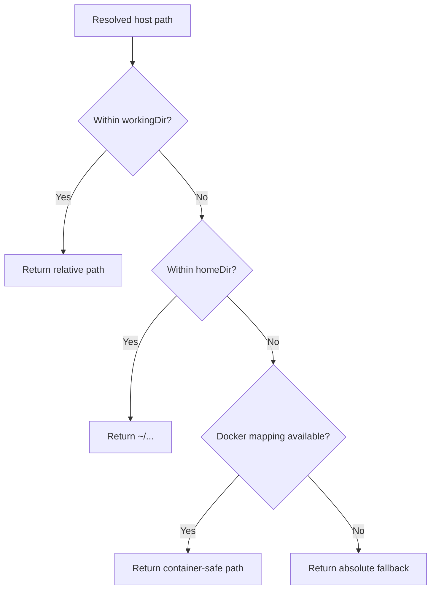

# Strict Multitenant Tool Scoping Hardening

Date: 2026-02-25

## Goal

Enforce strict user scoping (`ctx.userId`) across tool and plugin execution paths so one tenant cannot read, mutate, or control another tenant's runtime state.

## Enforced Guard Pattern

## Surfaces Hardened

- `topology`
  - Channel inventory now uses `channels.listForUserIds(visibleUserIds)` instead of global channel list behavior.
- Channel facade + tools
  - `channels.create/send/getHistory` now require caller `ctx` and enforce `ctx.userId` ownership.
  - Member add/remove tooling blocks cross-user target `agentId` resolution.
- Expose tools
  - `expose_list` reads scoped data via `storage.exposeEndpoints.findMany(ctx)`.
  - `expose_update` and `expose_remove` verify endpoint ownership before mutation.
- Signal tools
  - `signal_events_csv` now reads caller-scoped events only.
  - `signal_subscribe` / `signal_unsubscribe` reject target agents outside caller user scope.
- Process tooling/facade
  - Added `Processes.listForContext/getForContext/stopForContext/stopAllForContext`.
  - Shell process tools now call context-scoped facade methods.
- Agent model override tool
  - `set_agent_model` validates target agent belongs to caller user scope.
- Upgrade plugin
  - `self_upgrade` now requires descriptor user ownership to match `toolContext.ctx.userId`.
- Database plugin
  - `db_sql` moved from global plugin DB to per-user DB/doc roots under `dataDir/users/<encoded-user-id>/`.
  - Runtime and system prompt now load user-scoped DB metadata.

## Prompt/UX Alignment

- Updated prompt docs to reflect same-user restrictions for:
  - `signal_subscribe`
  - `signal_unsubscribe`
  - `set_agent_model`

## File Path Display Hardening (2026-02-26)

Issue:
- `read` tool metadata could surface host absolute paths for files outside `workingDir` (for example files under user home sibling directories such as `../knowledge/...`).

Fix:
- `Sandbox.read()` now computes `displayPath` with sandbox-safe precedence:
  1. Workspace-relative path when file is within `workingDir`
  2. `~`-relative path when file is within user `homeDir`
  3. Docker virtual path mapping (`/shared/*` or `/home/*`) when Docker translation applies
  4. Absolute fallback only when no safe rewrite is possible

Outcome:
- `read`/`read_json` metadata now avoids leaking host home mount paths in common user-home reads.
- Regression coverage added for:
  - `../knowledge/USER.md` returning `~/knowledge/USER.md`
  - Docker reads returning `~/...` display paths instead of host tmp paths

## Validation

- `yarn workspace daycare-cli typecheck`
- `yarn workspace daycare-cli test`
- `yarn workspace daycare-cli build`

All passed after hardening changes.
