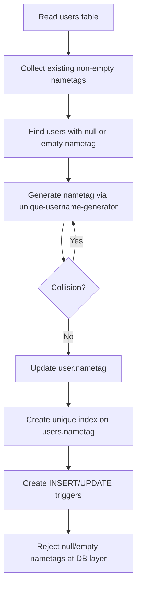

# Required Nametags Migration

This migration makes `users.nametag` required for all existing and future users.

## Summary

- Migration: `20260225_require_nametag`
- Backfills missing/empty nametags for existing rows
- Adds a full unique index on `users(nametag)`
- Adds insert/update triggers that reject null or empty nametags
- Uses `unique-username-generator` for generated nametags (`separator=""`, `randomDigits=3`)

## Data Flow

## Notes

- Runtime compatibility is preserved by generating a nametag inside `UsersRepository.create()` when callers do not provide one.
- Existing explicit nametag writes continue to work, with uniqueness enforced by DB constraints.
