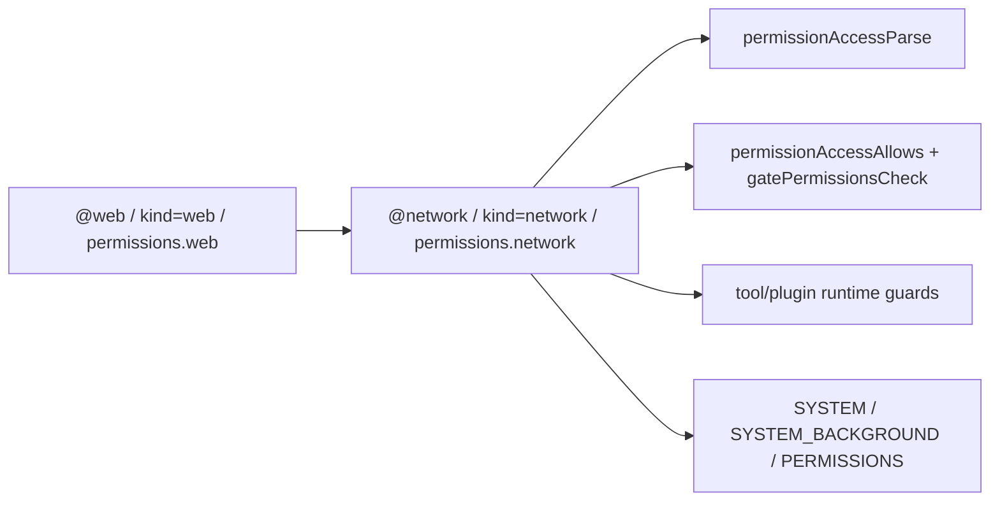

# Network Permission Rename

This change renames the permission tag from `@web` to `@network` and aligns the internal permission model with the same terminology.

## Scope

- Permission tag parsing and formatting now use `@network`.
- Permission access kind is now `network` (instead of `web`).
- Session permission field is now `network` (instead of `web`).
- Plugin checks now enforce `permissions.network`.
- Docs and prompts were updated to describe this as networking permission.
