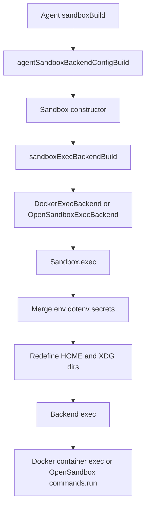
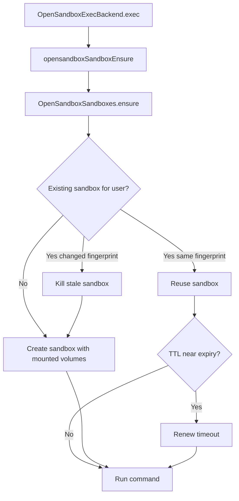

# OpenSandbox Exec Backend

This note documents the pluggable sandbox exec backend added for OpenSandbox.

## Scope

- `Sandbox.read()` and `Sandbox.write()` still operate on the host filesystem
- `Sandbox.exec()` now dispatches through a backend interface
- Docker remains the default backend
- OpenSandbox is selected through settings

## Execution Flow



## OpenSandbox Lifecycle



## Settings

```json
{
    "sandbox": {
        "backend": "opensandbox"
    },
    "opensandbox": {
        "domain": "http://localhost:8080",
        "apiKey": "optional-api-key",
        "image": "ubuntu",
        "timeoutSeconds": 600
    }
}
```

Validation rules:
- unknown `sandbox.backend` values are rejected during settings parse
- `opensandbox.domain` is required when `sandbox.backend` is `"opensandbox"`
- `opensandbox.image` is required when `sandbox.backend` is `"opensandbox"`
