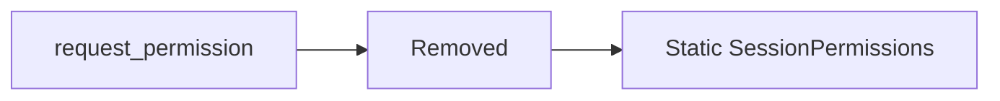

# Permission Request Existing Grants (Removed)

`request_permission` is removed from the runtime.

## Current behavior

- No permission request tool exists.
- No decision token registry exists.
- No connector permission approval prompt exists.

Permissions are now fixed by agent type and enforced directly by sandbox path/domain policies.
