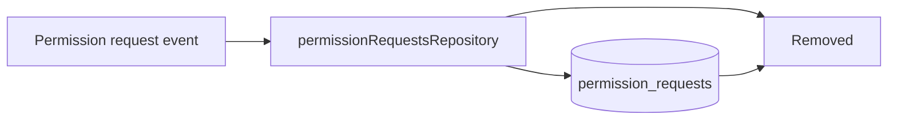

# Permission Request Storage Removed

Permission request persistence was removed from storage.

## What changed

- Deleted `permissionRequestsRepository` and its tests.
- Removed migration `20260221_add_permission_requests`.
- Removed migration registration from `_migrations.ts`.
- Removed `DatabasePermissionRequestRow` from `databaseTypes.ts`.

There is no `permission_requests` storage path in new databases.
