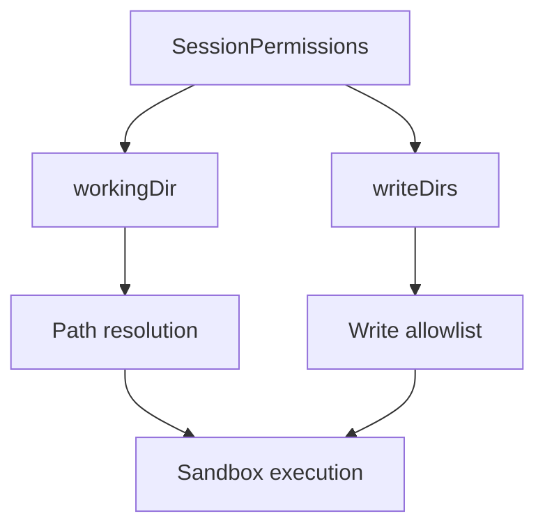
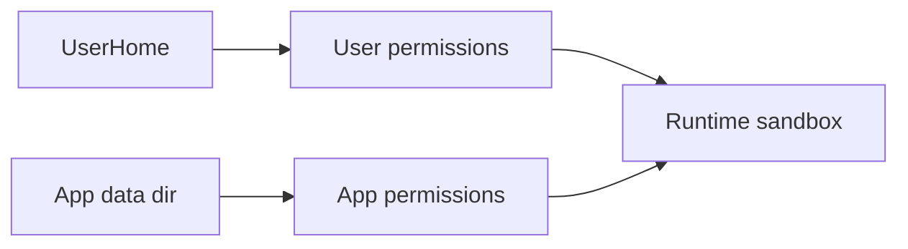
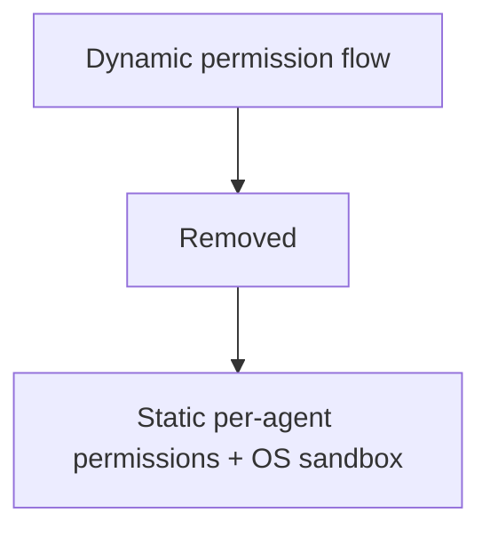

# Permissions

The runtime now uses a fixed sandbox model. Dynamic permission expansion is removed.

## Core model

`SessionPermissions` is now:

```ts
export type SessionPermissions = {
    workingDir: string;
    writeDirs: string[];
};
```

- `workingDir`: path base for relative tool operations.
- `writeDirs`: explicit writable roots.
- Reads are globally allowed except sandbox deny-lists and app isolation checks.



## Agent defaults

- User agents: `permissionBuildUser(userHome)` => `workingDir=userHome.desktop`, `writeDirs=[userHome.home]`.
- App agents: `appPermissionBuild(...)` => `workingDir=appDataDir`, `writeDirs=[appDataDir]`.



## Removed system

The following runtime capabilities were removed:

- `request_permission` tool
- `grant_permission` tool
- `PermissionRequestRegistry`
- connector permission callbacks (`onPermission`, `requestPermission`)
- permission tags (`@network`, `@events`, `@read:*`, `@write:*`, `@workspace`) as runtime expansion inputs



## Network and events

- Network is always available in sandboxed exec/process tools, but `allowedDomains` is mandatory and must be explicit.
- Wildcard `"*"` is rejected.
- Engine socket/event permission forwarding is removed.

## Path security utilities

Path hardening remains active under `sources/sandbox/`:

- `pathSanitize`
- `pathResolveSecure`
- `openSecure`

These continue to protect against traversal/symlink escape and TOCTOU-style races.
