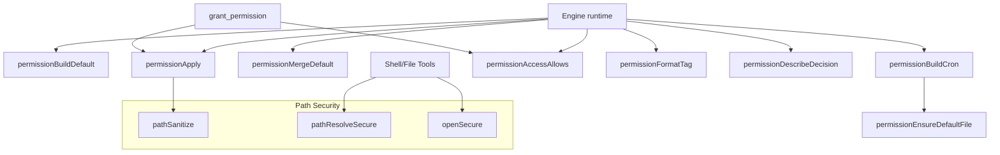
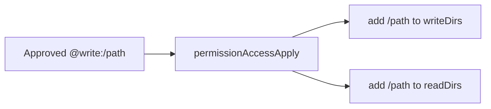
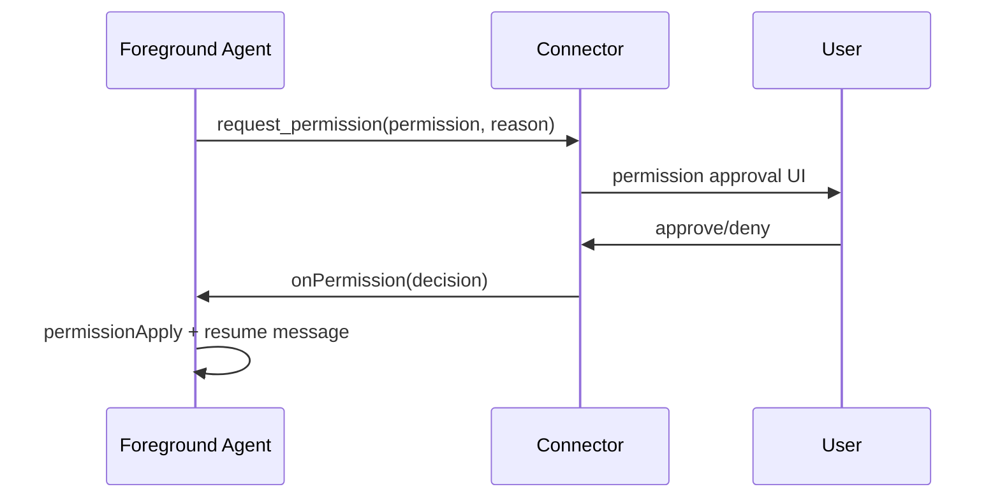
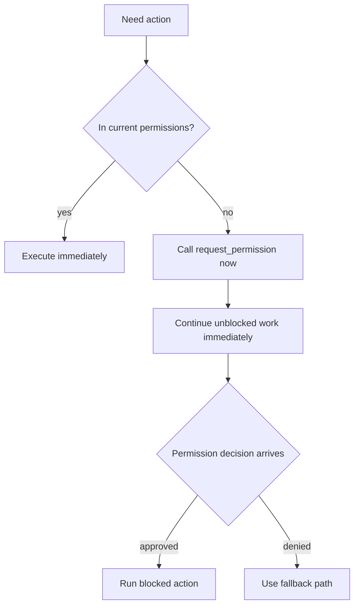
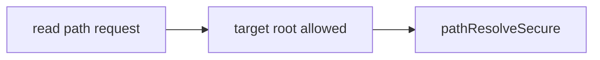
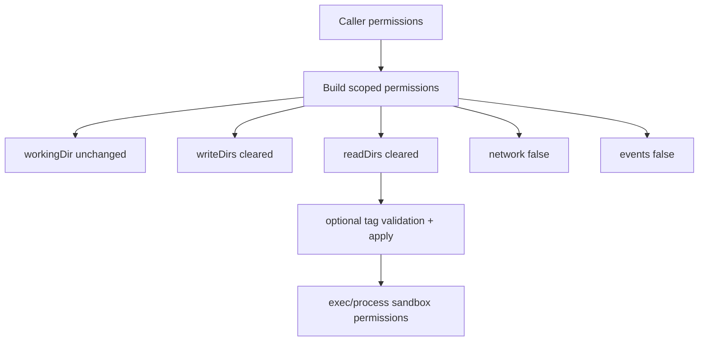
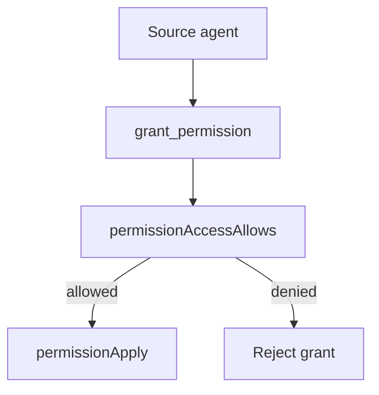
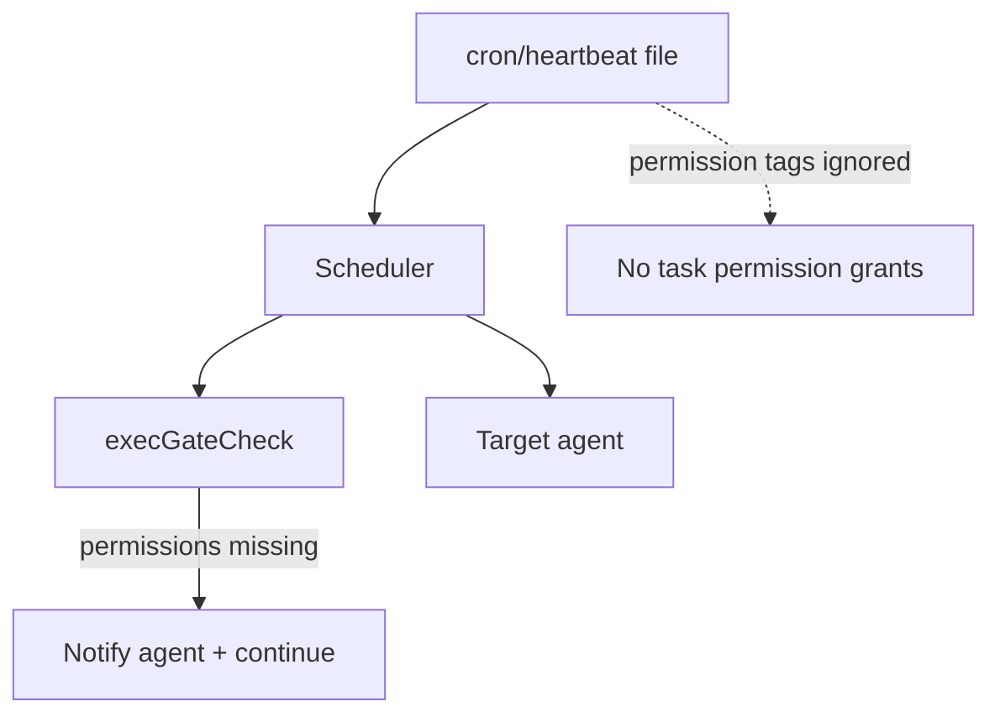
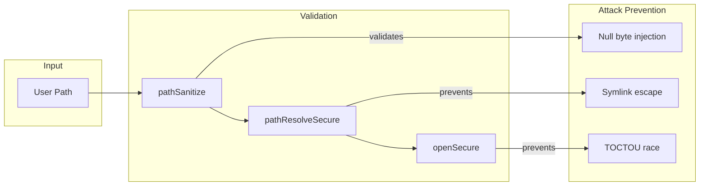

# Permissions

This document summarizes the permission helper functions extracted from the engine runtime.



## Helper roles

- `permissionBuildDefault`: create the initial agent permissions from workspace + config paths.
- `permissionBuildCron`: build cron-specific permissions that inherit defaults.
- `permissionEnsureDefaultFile`: merge default read/write directories into an agent.
- `permissionMergeDefault`: combine existing agent permissions with defaults.
- `permissionApply`: apply an approved permission decision to an agent.
- `permissionAccessAllows`: verify an agent already holds a permission before sharing it.
- `permissionTagsValidate`: validate that all permission tags are already held by the caller.
- `permissionFormatTag`: format the `@network`/`@events`/`@read`/`@write` tag used in logs.
- `permissionDescribeDecision`: human-readable label for permission decisions.

## Write implies read

When a `@write:<path>` permission is applied, the same sanitized path is also added to
`readDirs`. This keeps stored permission state aligned with the runtime rule that writable
paths must also be readable.



## Permission requests

Foreground agents request permissions directly from users via `request_permission`. Background
agents call the same tool; the engine routes the request through the most recent foreground agent
and includes the requesting agent id so the decision returns to the right agent. The tool returns
immediately, and the permission decision is delivered asynchronously. Agents should continue
unblocked work while the decision is pending, then apply the decision when it arrives.

Prompt stance: agents should request permissions proactively when blocked, without waiting for
manual pre-approval messages. Permissions act as safety rails that enable fast execution.
Prompt emphasis is explicit: move fast, move fast, move fast.





Tool payload shape:

```json
{
  "permission": "@network",
  "reason": "Need to verify the latest docs."
}
```

Tool availability by agent type:

| Tool | Foreground | Background |
|------|------------|------------|
| `request_permission` | ✓ | ✓ |

## Read tool behavior

The shell `read` tool allows any absolute path regardless of `readDirs`.



`@read:<path>` tags are ignored in `exec` and `process_start` tool-call permission scoping.

## Exec/process scoped permissions

`exec` and `process_start` now derive a write/network-restricted scope from caller permissions and never
mutate the caller permission object:

- keep caller `workingDir`
- drop `writeDirs`, `network`, and `events` by default
- keep `readDirs` empty in tool-call scope (reads are globally allowed)
- apply explicit non-read tags only after validating they are already allowed by caller permissions



## Events permission and unix sockets

`@events` grants scoped access to the Daycare engine unix socket for sandboxed `exec`,
`process_start`, and scheduled gate commands. When granted, sandbox config includes
`allowUnixSockets` with the configured server socket path.

```mermaid
flowchart LR
  P[@events granted] --> C[Sandbox config builder]
  C --> S[allowUnixSockets = [engine socket path]]
  S --> A[Sandboxed process can call daycare CLI events/control]
  P -. not granted .-> N[No allowUnixSockets entry]
```

## Direct grants

Agents can share permissions with other agents using the `grant_permission` tool.
The grant is only allowed when the source agent already has the permission, and
every grant must include a justification.



## Scheduled tasks (cron/heartbeat)

Cron and heartbeat tasks do not carry permission tags. Task prompts run with
the target agent's existing permissions only. Any `permissions` entries in task
files are ignored. `gate.permissions` are validated against the target agent's
permissions. If they are not already allowed, a system message is posted and the
task still runs (the gate is treated as successful).



## Path security utilities

The permissions system includes security hardening against path-based attacks:

### pathSanitize

Validates paths for dangerous characters and patterns. Rejects:

- **Null bytes** (`\x00`): Can truncate strings in C libraries
- **Control characters**: ASCII 0-31 (except tab/newline)
- **Excessive length**: Paths over 4096 characters

```typescript
import { pathSanitize } from "./pathSanitize.js";

pathSanitize("/valid/path");          // OK
pathSanitize("/path\x00/malicious");  // throws "Path contains null byte."
```

### pathResolveSecure

Securely resolves a path with symlink following and containment verification. Prevents symlink escape attacks by:

1. Resolving all symlinks via `fs.realpath()`
2. Checking containment against real paths

```typescript
import { pathResolveSecure } from "./pathResolveSecure.js";

const allowedDirs = ["/workspace"];
const { realPath, allowedBase } = await pathResolveSecure(allowedDirs, "/workspace/file.txt");
```

### openSecure

Opens a file handle with symlink protection to prevent TOCTOU (time-of-check to time-of-use) attacks:

```typescript
import { openSecure } from "./pathResolveSecure.js";

const handle = await openSecure("/workspace/file.txt", "r");
// File is guaranteed to be a regular file, not a symlink
```

## Security model



### Threats mitigated

| Threat | Mitigation | Location |
|--------|------------|----------|
| Symlink escape | `fs.realpath()` before containment check | `pathResolveSecure` |
| TOCTOU race | Atomic open with `lstat` + file handle | `openSecure`, handlers |
| Null byte injection | Path validation | `pathSanitize` |
| Control character injection | Path validation | `pathSanitize` |
| Path length DoS | 4096 char limit | `pathSanitize` |
| Empty workingDir bypass | Nullish coalescing | `permissionMergeDefault` |
| Scheduled task permission escalation | Task permission tags ignored; gate permissions validated | `cronStore`, `heartbeatStore`, `execGateCheck` |
