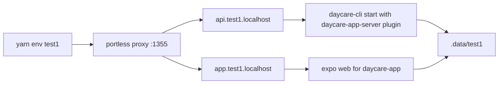
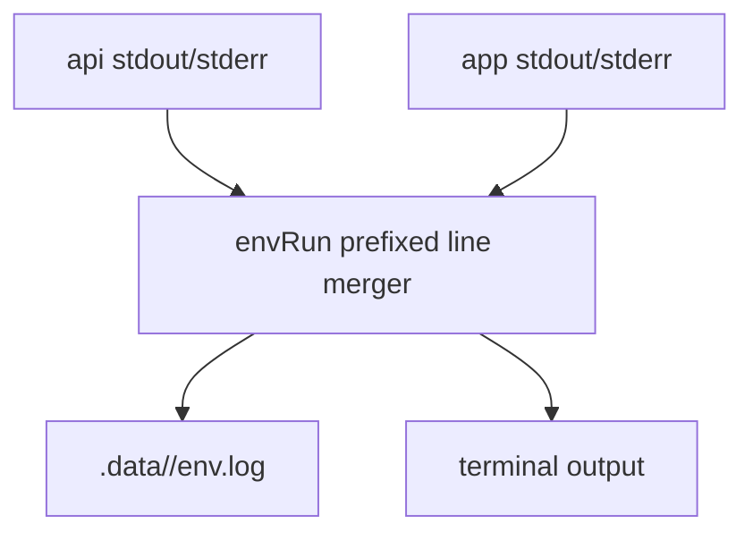

# Portless Named Dev Environment

Named development environments are started with `yarn env <name>`.

Each environment uses `.data/<name>` for state and writes a merged prefixed log to `.data/<name>/env.log`.

## Runtime topology

## Logs

