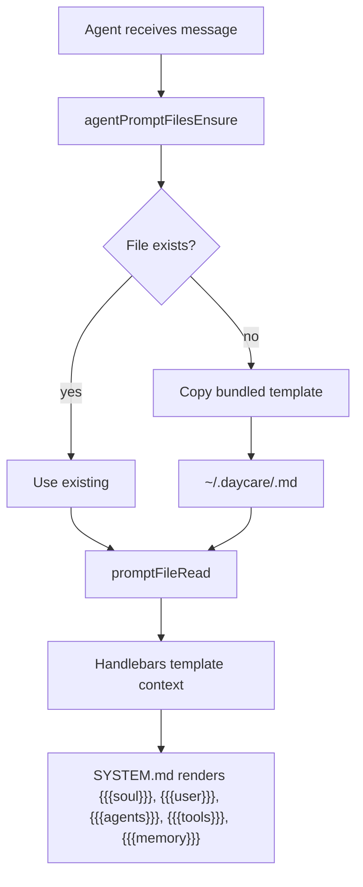

# Prompt files

Daycare injects editable Markdown files into the system prompt. Agents read them every turn and can update them to persist knowledge across sessions.

## Files

| File | Path | Purpose |
|------|------|---------|
| SOUL.md | `~/.daycare/SOUL.md` | Agent personality and behavioral refinements |
| USER.md | `~/.daycare/USER.md` | Stable user facts, preferences, and context |
| AGENTS.md | `~/.daycare/AGENTS.md` | Workspace operating playbook, routines, and heartbeat guidance |
| TOOLS.md | `~/.daycare/TOOLS.md` | Learned tool knowledge — tips, pitfalls, patterns |
| MEMORY.md | `~/.daycare/MEMORY.md` | Durable working notes and active context across sessions |

All five are automatically created from bundled templates on first run if missing.

## Lifecycle

## Injection

- Foreground agents see all five files in their system prompt.
- Background agents do not receive SOUL, USER, AGENTS, TOOLS, or MEMORY.
- Paths are shown in the write permissions allowlist so agents can edit them.
- Content is injected via triple-brace Handlebars (for example, `{{{agents}}}`) to avoid HTML escaping.
- Runtime topology is queried through the `topology` tool rather than a prompt file.

## Source templates

Bundled defaults live in `sources/prompts/`:
- `SOUL.md` — personality scaffold
- `USER.md` — blank user profile fields
- `AGENTS.md` — workspace playbook template for routines and memory hygiene
- `TOOLS.md` — empty tool knowledge tables
- `MEMORY.md` — persistent working-memory template
- `SYSTEM_TOOLS_RLM.md` — `run_python` tool-call template with injected Python preamble
- `SYSTEM_TOOLS_RLM_INLINE.md` — no-tools `<run_python>` instructions with injected Python preamble
