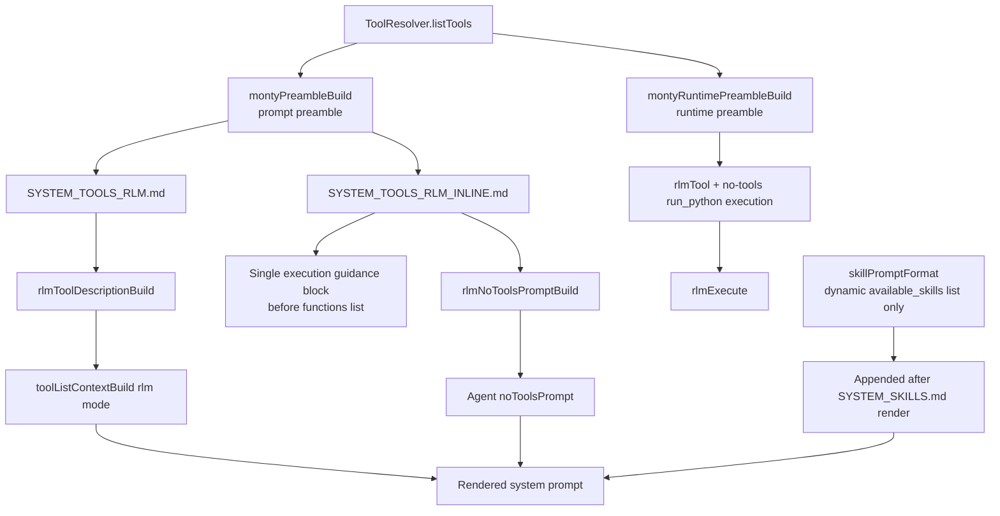

# Prompt Tools Restructure

RLM tool-mode prompt text now lives in bundled markdown templates:

- `sources/prompts/SYSTEM_TOOLS_RLM.md` for `run_python` tool-call mode
- `sources/prompts/SYSTEM_TOOLS_RLM_INLINE.md` for no-tools `<run_python>` tag mode

Both builders inject only the Python prompt preamble (`{{{preamble}}}`) and no longer include
skill lists. Skills are appended once after rendering `SYSTEM_SKILLS.md`.
For no-tools tag mode, Python execution guidance is merged into one block before
the generated function list in `SYSTEM_TOOLS_RLM_INLINE.md`.

Runtime execution now uses a separate minimal Monty preamble (`montyRuntimePreambleBuild`)
without prompt comments/stubs.

