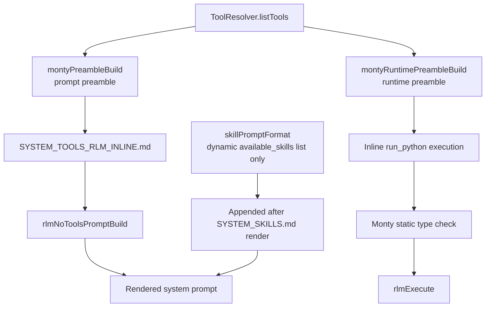

# Prompt Tools Restructure

RLM prompt text now lives in one bundled template:

- `sources/prompts/SYSTEM_TOOLS_RLM_INLINE.md` for inline `<run_python>` execution

The builder injects only the Python prompt preamble (`{{{preamble}}}`) and no longer includes
skill lists. Skills are appended once after rendering `SYSTEM_SKILLS.md`.

Runtime execution uses a separate minimal Monty preamble (`montyRuntimePreambleBuild`)
without prompt comments and with compact `TYPE_CHECKING`-guarded runtime stubs.
RLM execution enables Monty static type checking (`typeCheck: true`) before execution starts.

