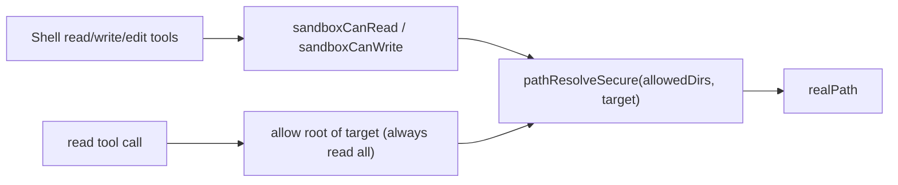

# Read/Write Permission Alignment

Read/write path resolution is now centralized in sandbox helpers:

- `sandboxCanRead(permissions, target)`
- `sandboxCanWrite(permissions, target)`

These functions receive `SessionPermissions` and return the resolved real path when allowed.

`sandboxCanRead` now ignores `readDirs` and allows any absolute read path.

`sandboxCanWrite` only allows writes within explicitly granted `writeDirs` (it does not implicitly allow `workingDir`).

