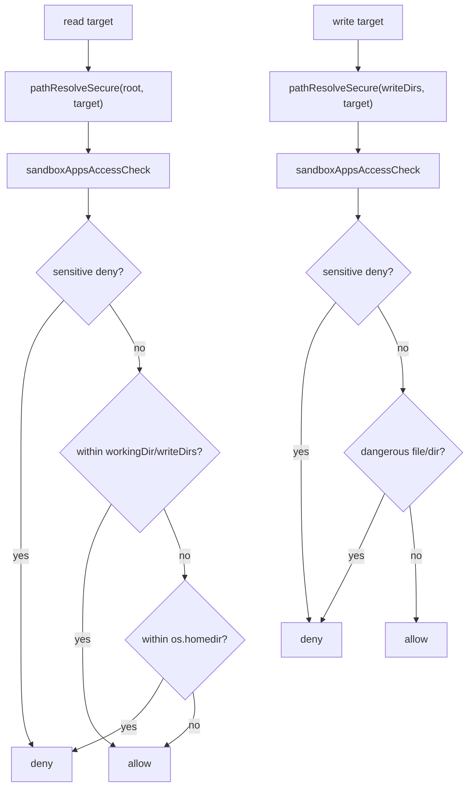

# Read/Write Permission Alignment

Read and write tools now enforce the same sensitive-path and dangerous-file protections as the exec sandbox policy.

- `sandboxCanRead(permissions, target)`
- `sandboxCanWrite(permissions, target)`

Shared helpers used by both tools:

- `sandboxSensitiveDenyPathsBuild` for sensitive home/system deny paths
- `sandboxPathDenyCheck` for denied directory containment checks
- `sandboxDangerousFilesBuild` + `sandboxDangerousFileCheck` for dangerous shell/git/editor targets

Read behavior:

- Absolute path resolution stays broad
- App isolation applies first
- Sensitive deny paths are blocked
- Explicitly granted `workingDir`/`writeDirs` paths are allowed
- Remaining OS-home paths are denied
- Non-home system paths remain readable

Write behavior:

- Must be inside explicit `writeDirs`
- App isolation applies
- Sensitive deny paths are blocked even if inside `writeDirs`
- Dangerous runtime targets (`.bashrc`, `.git/hooks`, `.vscode`, etc.) are blocked

