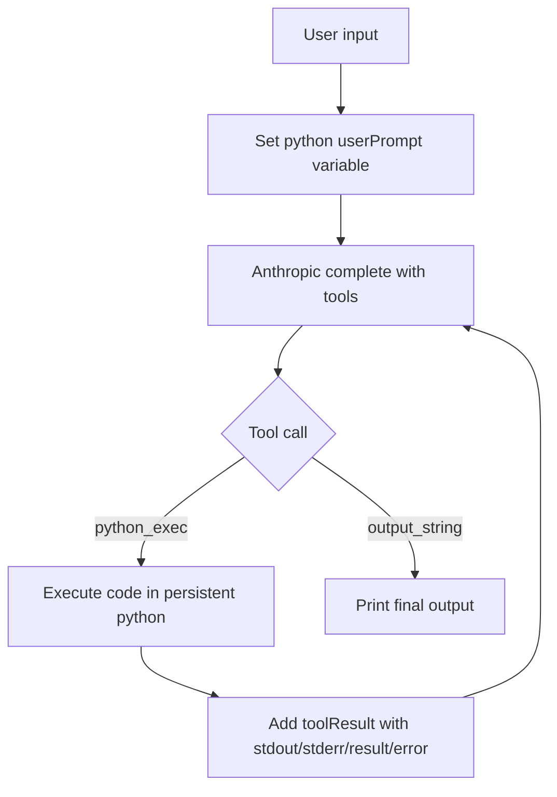

# Recipe: PyREPL

Adds a new recipe entry:
- `yarn recipe pyrepl [modelId] [sandboxName]`

Source entry:
- `packages/daycare/sources/recipe/recipePyrepl.ts`

Behavior:
- runs a sequential loop with strict tool-only protocol:
  - `python_exec({ code: string })` for intermediate Python execution
  - `output_string({ output: string })` for final user-visible output
- each user turn is injected into Python variable `userPrompt`
- user prompt text is not sent directly as chat text content
- prompt guidance explicitly states that `userPrompt` can be very long
- executes python actions in a persistent system `python3` subprocess
- uses a recipe sandbox directory under `sources/recipe/.sandbox/<sandboxName>`
- returns stdout/stderr/result/error through `toolResult` messages

Sandbox notes:
- sandbox write checks are enforced in the python bridge for common file write operations
- write target is restricted to the sandbox directory

