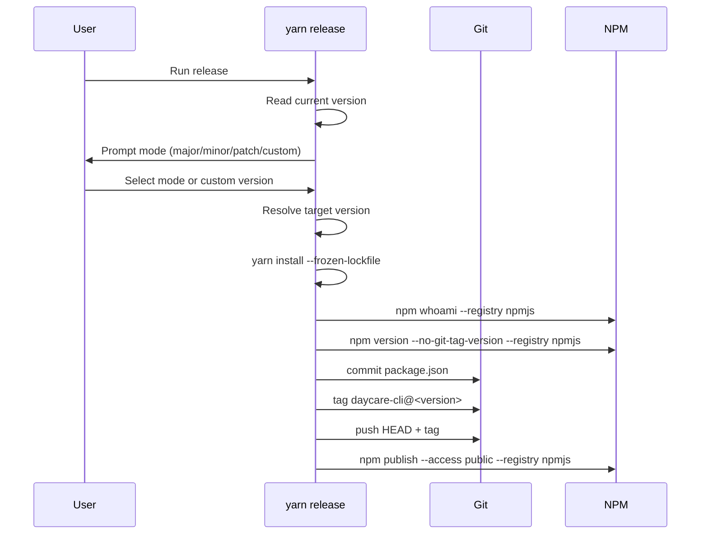

# Release command

`yarn release` now orchestrates publishing `daycare-cli` from the monorepo root.

## Flow

1. Read current `daycare-cli` version from `packages/daycare/package.json`.
2. Prompt for release mode (`patch`, `minor`, `major`, or `custom`).
3. Resolve next version from the selected mode.
4. Run `yarn install --frozen-lockfile` in the monorepo root.
5. Verify npm auth with `npm whoami --registry https://registry.npmjs.org/`.
6. Run `npm version <version> --no-git-tag-version --registry https://registry.npmjs.org/` in `packages/daycare`.
7. Commit `packages/daycare/package.json`.
8. Create tag `daycare-cli@<version>`.
9. Push branch and tag to `origin`.
10. Run `npm publish --access public --registry https://registry.npmjs.org/` from `packages/daycare`.

## Sequence

