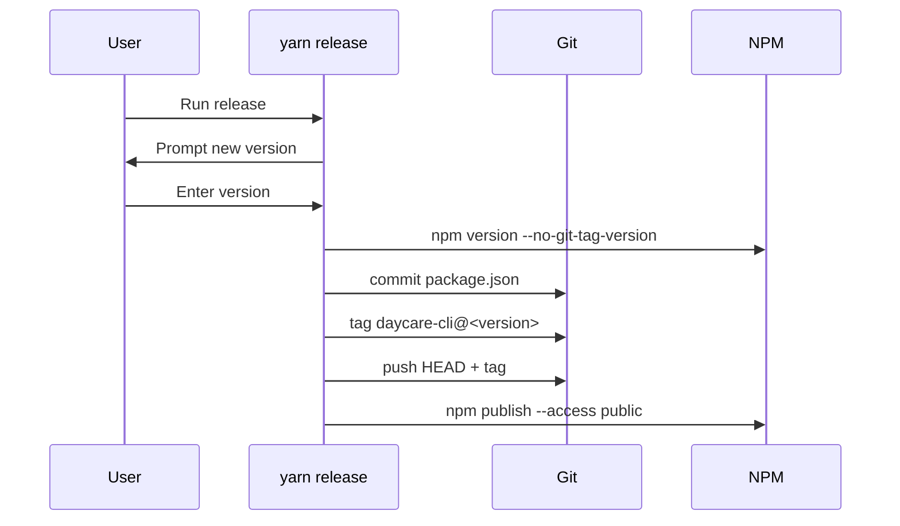

# Release command

`yarn release` now orchestrates publishing `daycare-cli` from the monorepo root.

## Flow

1. Prompt for a new semantic version.
2. Run `npm version <version> --no-git-tag-version` in `packages/daycare`.
3. Commit `packages/daycare/package.json`.
4. Create tag `daycare-cli@<version>`.
5. Push branch and tag to `origin`.
6. Run `npm publish --access public` from `packages/daycare`.

## Sequence

