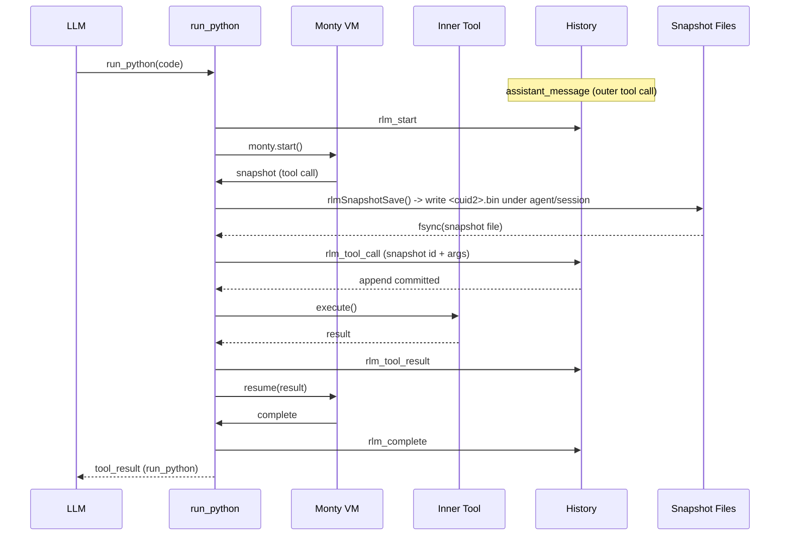
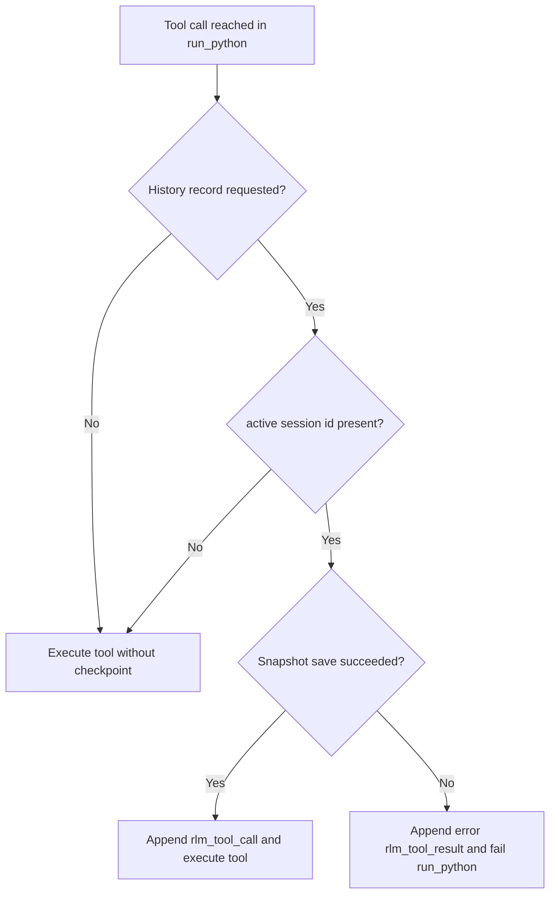

# RLM Checkpointing

## Overview

RLM checkpointing persists `run_python` interpreter progress into agent history so execution can survive a process restart.

Each `run_python` call now writes:

- `rlm_start` when execution begins
- `rlm_tool_call` before each inner tool call (stores snapshot id)
- `rlm_tool_result` after each inner tool call
- `rlm_complete` when execution ends (success or error)

The outer assistant/tool protocol remains unchanged:

- assistant emits the `run_python` tool call
- `tool_result` completes that outer call

RLM checkpoint records are internal and are skipped when rebuilding model context.

Checkpoint file I/O lives in `engine/modules/rlm/`:
- `rlmSnapshotSave(...)` persists dump for an explicit `sessionId` and returns cuid2 `snapshotId`
- `rlmSnapshotLoad(...)` reads dump by explicit `sessionId` + `snapshotId` and returns `Uint8Array | null`

## Normal Flow



## Restore Flow (Flat Agent Loop)

```mermaid
sequenceDiagram
    participant Agent
    participant History
    participant Loop as agentLoopRun
    participant VM as Monty VM
    participant Tool as Inner Tool
    participant Snap as Snapshot Files

    Note over Agent: Process restarted
    Agent->>History: resolve pending phase
    alt assistant_message has run_python with no rlm_start
        History-->>Agent: vm_start phase
        Agent->>Loop: resume at VM_START
        Loop->>History: rlm_start
    else rlm_start + latest rlm_tool_call
        History-->>Agent: tool_call phase
        Agent->>Snap: load snapshot by id from active session folder
        alt snapshot load fails
            Snap-->>Agent: missing/corrupt snapshot
            Agent->>History: rlm_complete(isError=true, "Python VM crashed ...")
        else snapshot loaded
            Agent->>VM: resume(exception: "Process was restarted")
        end
        VM-->>Loop: next snapshot or complete
    else rlm_start with no snapshot
        History-->>Agent: error phase
        Agent->>History: rlm_complete(isError=true)
    end
    Loop->>History: rlm_tool_call / rlm_tool_result / rlm_complete
```

## Record Reference

- `rlm_start`
  - `toolCallId`, `code`, `preamble`
- `rlm_tool_call`
  - `toolCallId`, cuid2 `snapshotId`, `printOutput`, `toolCallCount`, `toolName`, `toolArgs`
- `rlm_tool_result`
  - `toolCallId`, `toolName`, `toolResult`, `toolIsError`
- `rlm_complete`
  - `toolCallId`, `output`, `printOutput`, `toolCallCount`, `isError`, optional `error`

## Startup Recovery Behavior

- Startup resolves one pending flat-loop phase via `agentLoopPendingPhaseResolve`.
- `vm_start` phase: re-parse `<run_python>` blocks from the latest `assistant_message` and continue from VM start.
- `tool_call` phase: load the latest `rlm_tool_call.snapshotId` from `agents/<agentId>/snapshots/<sessionId>/`, resume with runtime error (`Process was restarted`), then continue normal tool-call phases.
- `error` phase: append `rlm_complete` with `isError=true` and error text (`Process was restarted before any tool call`).
- Read/write path consistency: both writer and restore reader use `rlmSnapshotSave(...)` / `rlmSnapshotLoad(...)`.

## Snapshot Creation Contract

Checkpoint creation is strict when history checkpointing is active.
When a history callback is present and a session id exists, snapshot persistence must succeed before inner tool execution.
If checkpoint save fails, runtime appends an error `rlm_tool_result` and aborts the current `run_python` block.
Inline base64 fallback is not allowed.



## Migration Strategy for Large Databases

Legacy inline snapshots cleanup now scans `session_history` in id-ordered batches (`LIMIT 100`) and updates rows incrementally.
The migration runs outside the global migration transaction and commits per batch to bound WAL/journal growth on large databases.
