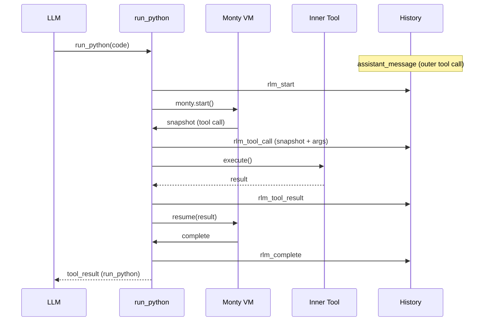

# RLM Checkpointing

## Overview

RLM checkpointing persists `run_python` interpreter progress into agent history so execution can survive a process restart.

Each `run_python` call now writes:

- `rlm_start` when execution begins
- `rlm_tool_call` before each inner tool call (includes VM snapshot)
- `rlm_tool_result` after each inner tool call
- `rlm_complete` when execution ends (success or error)

The outer assistant/tool protocol remains unchanged:

- assistant emits the `run_python` tool call
- `tool_result` completes that outer call

RLM checkpoint records are internal and are skipped when rebuilding model context.

## Normal Flow



## Restore Flow (Flat Agent Loop)

```mermaid
sequenceDiagram
    participant Agent
    participant History
    participant Loop as agentLoopRun
    participant VM as Monty VM
    participant Tool as Inner Tool

    Note over Agent: Process restarted
    Agent->>History: resolve pending phase
    alt assistant_message has run_python with no rlm_start
        History-->>Agent: vm_start phase
        Agent->>Loop: resume at VM_START
        Loop->>History: rlm_start
    else rlm_start + latest rlm_tool_call
        History-->>Agent: tool_call phase
        Agent->>VM: load snapshot + resume(exception: "Process was restarted")
        VM-->>Loop: next snapshot or complete
    else rlm_start with no snapshot
        History-->>Agent: error phase
        Agent->>History: rlm_complete(isError=true)
    end
    Loop->>History: rlm_tool_call / rlm_tool_result / rlm_complete
```

## Record Reference

- `rlm_start`
  - `toolCallId`, `code`, `preamble`
- `rlm_tool_call`
  - `toolCallId`, base64 `snapshot`, `printOutput`, `toolCallCount`, `toolName`, `toolArgs`
- `rlm_tool_result`
  - `toolCallId`, `toolName`, `toolResult`, `toolIsError`
- `rlm_complete`
  - `toolCallId`, `output`, `printOutput`, `toolCallCount`, `isError`, optional `error`

## Startup Recovery Behavior

- Startup resolves one pending flat-loop phase via `agentLoopPendingPhaseResolve`.
- `vm_start` phase: re-parse `<run_python>` blocks from the latest `assistant_message` and continue from VM start.
- `tool_call` phase: load the latest `rlm_tool_call.snapshot`, resume with runtime error (`Process was restarted`), then continue normal tool-call phases.
- `error` phase: append `rlm_complete` with `isError=true` and error text (`Process was restarted before any tool call`).
