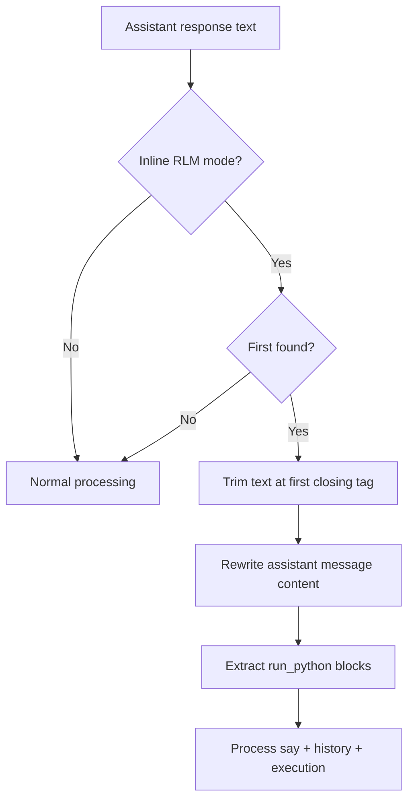

# Inline RLM First-Close Trim

## Summary

In inline RLM mode (`noTools + rlm + say`), assistant text is now cut at the first `</run_python>` before any downstream handling.

- Everything after the first closing `</run_python>` tag is discarded for this turn.
- Only the first `<run_python>...</run_python>` block is eligible for execution.
- The trimmed text is written back into assistant context/history immediately.
- Inference calls now pass a best-effort stop hint: `stop: ["</run_python>"]`.

This prevents trailing model text from influencing say-processing, run extraction, or the next inference turn.

## Flow

