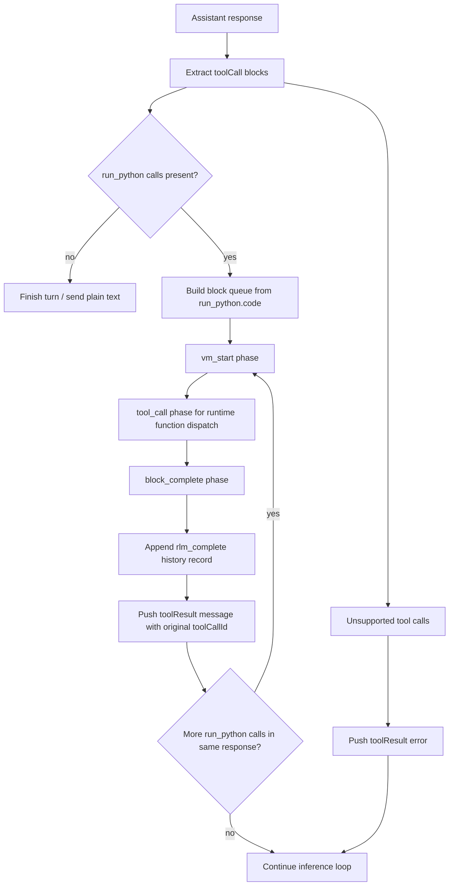

# RLM Multiline Python Guidance

Updated prompt guidance for native `run_python` tool-calling and existing VM execution phases.

## Summary
- Replaced `<run_python>...</run_python>` text-tag parsing in the main inference loop with native assistant tool calls.
- Prompt now instructs models to call `run_python(code=...)` directly.
- Runtime still uses the same VM phases (`vm_start` -> `tool_call` -> `block_complete`) for execution.
- Each `run_python` call result is posted back as a `toolResult` message with the original assistant `toolCallId`.
- RLM history records (`rlm_start`, `rlm_tool_call`, `rlm_tool_result`, `rlm_complete`) remain intact.
- Unsupported tool calls in this mode return immediate tool-result errors so inference can recover and continue.

## Flow

