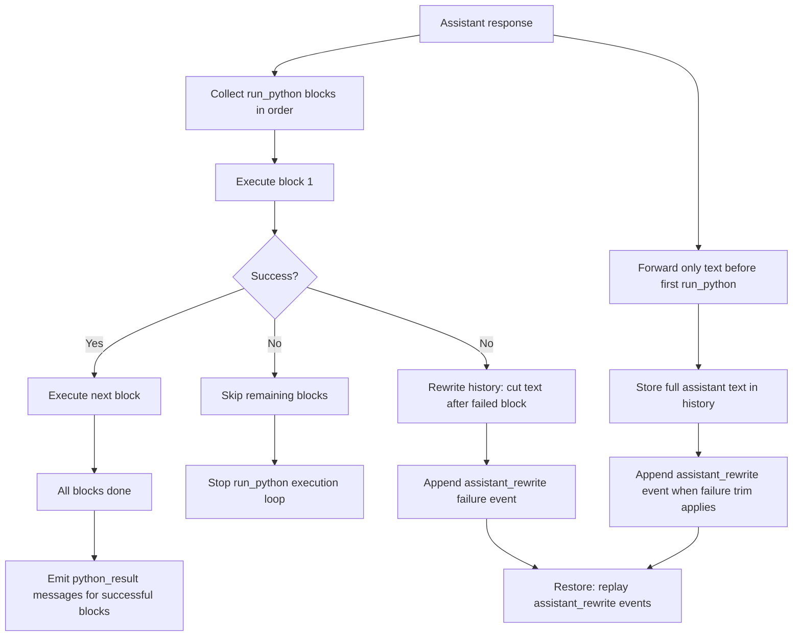

# RLM Multiline Python Guidance

Updated prompt guidance for inline RLM Python execution and response-tag handling.

## Summary
- Added inline-mode support for multiple `<run_python>` tags per assistant response.
- Added sequential execution semantics: execute in order and stop at first failed block.
- User-facing output now forwards only plain text before the first `<run_python>` tag.
- Removed `<say>` tag parsing from runtime forwarding and prompt requirements.
- On first failed `<run_python>` block, rewrote context history to drop everything after the failed block.
- Removed synthetic ignored/failure notices from no-tools message flow when rewrite trimming applies.
- Persisted explicit `assistant_rewrite` history events for each rewrite.
- Restore now replays `assistant_rewrite` events directly (no trim recomputation on load).
- Extracted trim logic into ops helpers:
  `agentMessageRunPythonFailureTrim(successfulExecutionCount)`.
- Updated inline prompt examples to show multi-tag execution and prefix-only user output before execution blocks.
- Clarified that tool calls return plain LLM strings, not structured payloads.
- Added test assertions so these instructions stay present.

## Flow

