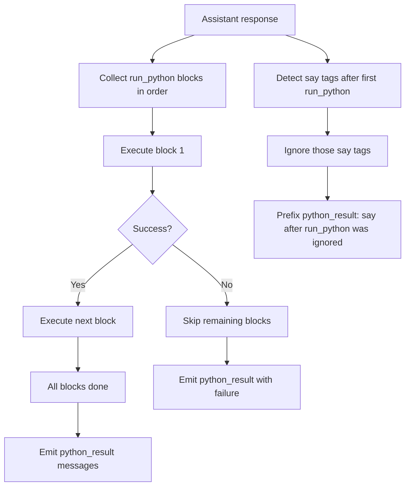

# RLM Multiline Python Guidance

Updated prompt guidance for inline RLM Python execution and response-tag handling.

## Summary
- Added inline-mode support for multiple `<run_python>` tags per assistant response.
- Added sequential execution semantics: execute in order and stop at first failed block.
- Added strict post-`<run_python>` `<say>` suppression with an explicit notice line.
- Updated inline prompt examples to show multi-tag execution and ignored post-run `<say>`.
- Clarified that tool calls return plain LLM strings, not structured payloads.
- Added test assertions so these instructions stay present.

## Flow

