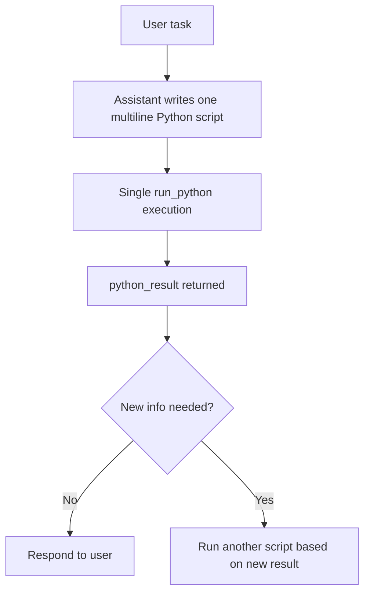

# RLM Multiline Python Guidance

Updated prompt guidance for ErrorLine and Line in ErrorLine to prefer one multiline Python script per task.

## Summary
- Added explicit instruction in tool-call mode prompt to keep work in one script.
- Added explicit instruction in inline tag mode prompt to keep work in one `<run_python>` block.
- Added examples showing a multiline script pattern with vanilla Python only.
- Clarified that tool calls return plain LLM strings, not structured payloads.
- Added test assertions so these instructions stay present.

## Flow

