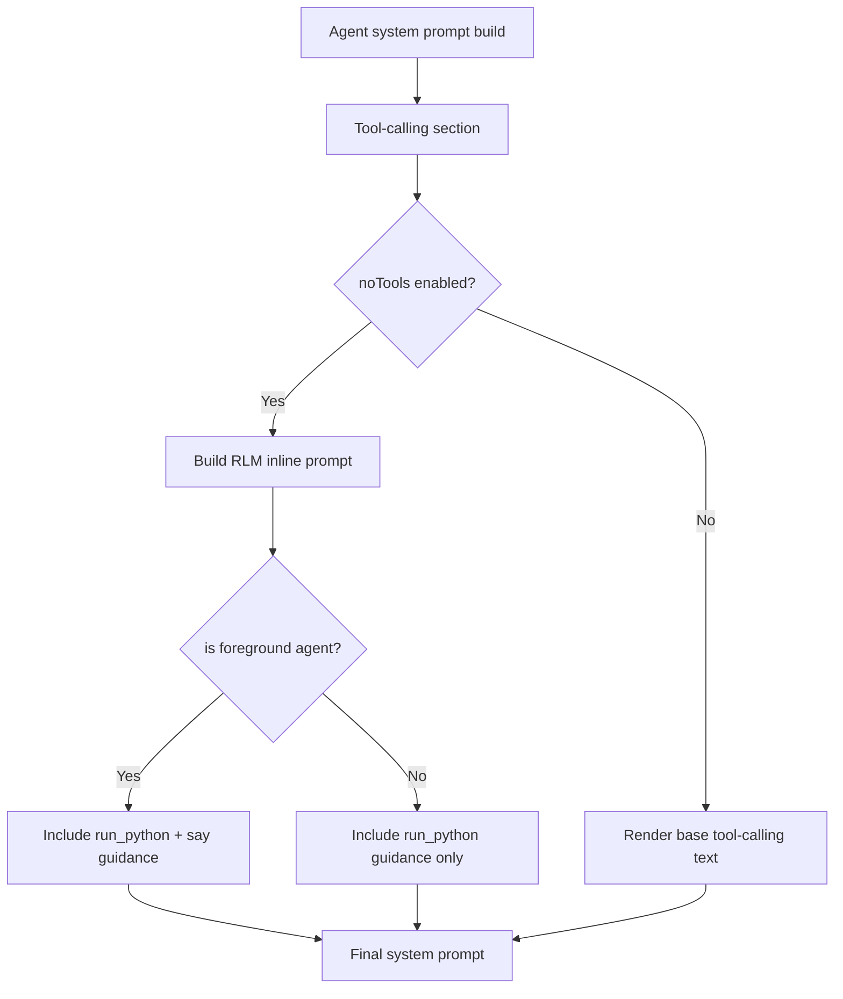

# RLM Non-Foreground `<say>` Prompt Gating

## Summary

In no-tools RLM mode, the inline Python section now renders `<say>` guidance only for foreground agents.  
Background/subagent/app/permanent/system agents still receive `<run_python>` instructions, but they no longer see `<say>` tag policy text.

## Flow

