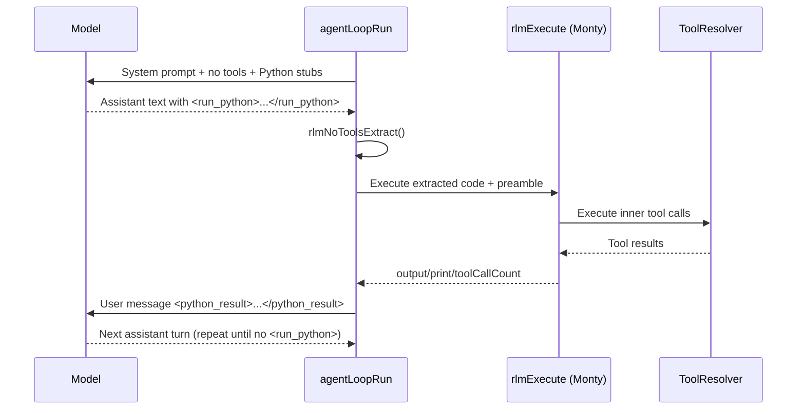

# RLM noTools Tag Mode

Tag mode is enabled only when `features.noTools`, `features.rlm`, and `features.say` are all true.
In that mode, the model cannot call tools directly.
Instead, it emits Python in `<run_python>...</run_python>`, and the agent loop executes that
code with Monty via `rlmExecute()`.

## Flow

## Key Files

- `packages/daycare/sources/engine/modules/rlm/rlmNoToolsPromptBuild.ts`
- `packages/daycare/sources/engine/modules/rlm/rlmNoToolsExtract.ts`
- `packages/daycare/sources/engine/modules/rlm/rlmNoToolsResultMessageBuild.ts`
- `packages/daycare/sources/engine/agents/ops/agentLoopRun.ts`
- `packages/daycare/sources/engine/modules/rlm/rlmExecute.ts`

## Notes

- Tool exposure is empty when `noTools` is true (`toolListContextBuild()` early return).
- `<say>` processing runs before `<run_python>` extraction, so user-facing say blocks are preserved.
- Prompt rules enforce one `<run_python>` block per assistant response in tag mode.
- When both tags are present in one response, `<say>` must come before `<run_python>`.
- Prompt explicitly requires returning via the final expression line; use `print()` only for debug output.
- User-facing announcement style (plain-language updates, long-running pre-announcements, and retry dedupe) now lives in the shared system prompt so it applies in all modes, not only RLM tag mode.
- After execution, `<python_result>` is injected and the model gets a follow-up turn to emit `<say>` based on results.
- Checkpointing uses generated `toolCallId` values and reuses `appendHistoryRecord` callbacks.
