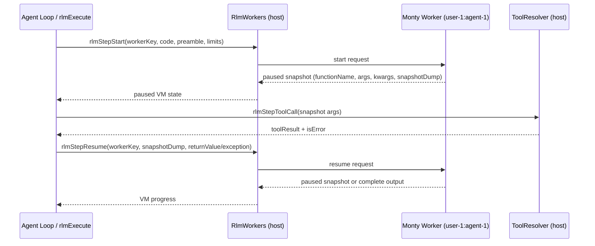
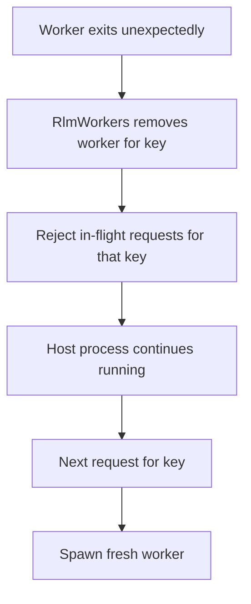

# RLM Per-Agent Workers

## Overview

RLM (`run_python`) now isolates Monty VM execution in dedicated child processes managed by `RlmWorkers`.

Key behavior:
- worker key is derived from execution context (`ctx.userId` + optional `ctx.agentId`)
- each key gets its own worker process
- `rlmStepStart()` and `rlmStepResume()` execute in the keyed worker
- host process still performs tool dispatch (`rlmStepToolCall`) and history writes

## Why

Monty can fail at runtime. Running VM segments in child processes isolates failures from the main Daycare server process and prevents whole-process crashes.

## Flow

## Crash Handling

