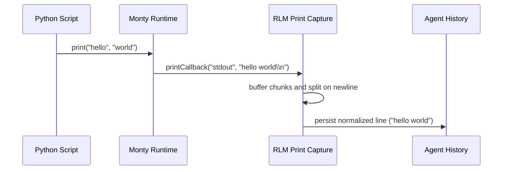

# RLM Print Callback

## Summary

RLM execution now uses Monty's native `print` callback instead of rewriting Python `print(...)` calls to a custom external function.

## Flow

## Notes

- Removed `__daycare_print__` preamble stubs and code rewrite logic.
- `rlmExecute` and `rlmRestore` pass `printCallback` into `start(...)` and `MontySnapshot.load(...)`.
- Print output remains available as normalized lines in `printOutput`.
