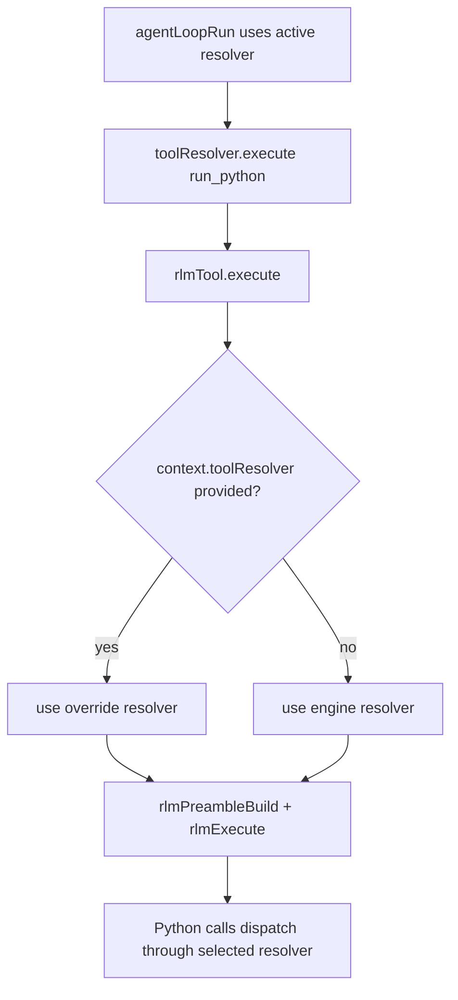

# RLM Python Tool Mode

This change adds an engine-level **RLM** mode controlled by the root config key `rlm`.
When `rlm` is enabled, agent contexts expose only the `run_python` tool while keeping the
full tool registry available behind the scenes.

## Behavior

- `rlm: false` (default): classic tool exposure/filtering behavior remains unchanged.
- `rlm: true`: `toolListContextBuild()` returns only `run_python`.
- `run_python` executes Monty Python code and routes external function calls to `ToolResolver.execute()`.
- Python tool stubs are generated from currently registered tools and embedded in `run_python` description.

## Data Flow

```mermaid
flowchart TD
  A[LLM emits run_python(code)] --> B[rlmTool.execute]
  B --> C[rlmPreambleBuild from ToolResolver.listTools]
  C --> D[rlmExecute Monty start/resume loop]
  D -->|snapshot:functionName| E[rlmArgsConvert]
  E --> F[ToolResolver.execute]
  F --> G[rlmResultConvert]
  G --> D
  D --> H[output + printOutput + toolCallCount]
  H --> I[toolResult message to model]
```

## Runtime Resolver Selection

`run_python` now resolves tools from the active runtime resolver in `ToolExecutionContext`
when present. This ensures app/subagent overrides are used consistently for both:
- generated Python stubs
- nested tool dispatch from Python



## Limits and Errors

`rlmExecute` enforces resource limits (`maxDurationSecs`, `maxMemory`, `maxRecursionDepth`,
`maxAllocations`).

Errors are surfaced as:
- Syntax errors: `MontySyntaxError` with retry guidance
- Runtime errors: `MontyRuntimeError` traceback
- Tool failures: resumed as Python `ToolError` exceptions
