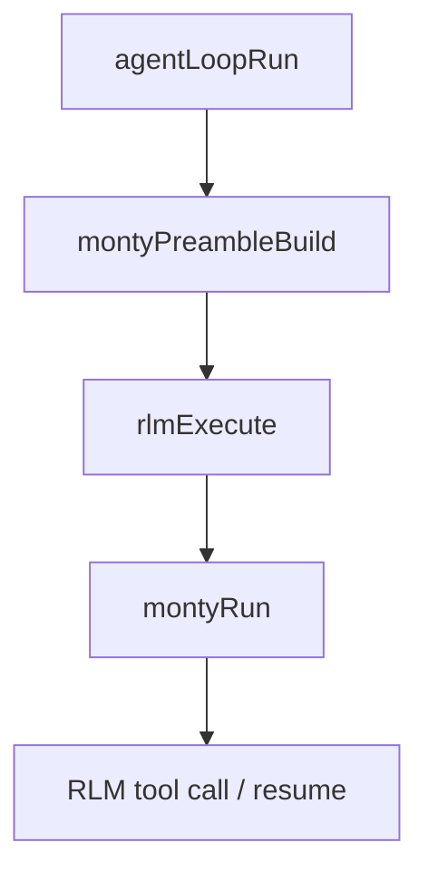

# RLM Runtime Preamble Removal

## Overview

RLM no longer applies a separate runtime preamble normalization path.

- Removed `rlmPreambleNormalize`.
- Removed `montyRuntimePreambleBuild`.
- Runtime preamble assembly now uses `montyPreambleBuild` directly.

This keeps type-checking stubs as the full preamble payload instead of stripping them via a runtime normalization step.

## Execution Flow

## Recovery Implication

During recovery, `Process was restarted during tool call` is handled from the saved RLM state and output, while preamble construction stays identical to normal execution.
