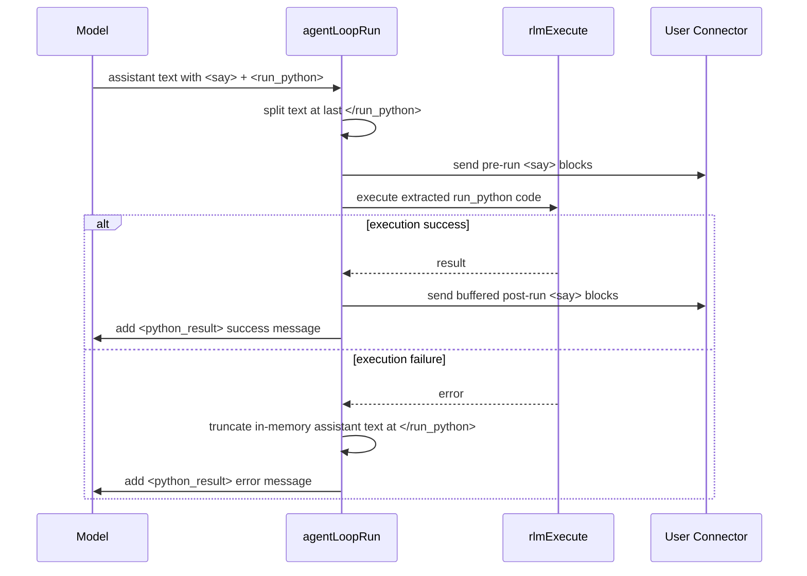

# Daycare RLM `<say>` + `<run_python>` Flow

## Summary

In no-tools RLM mode, `<say>` blocks are now split around the last `</run_python>` tag:
- `<say>` before `</run_python>` is sent immediately.
- `<say>` after `</run_python>` is buffered and sent only when Python execution succeeds.
- On execution failure, assistant text after the last `</run_python>` is removed from in-memory context before the next model turn.

This keeps user-visible messages aligned with actual execution state without mutating persisted history records.

## Sequence

