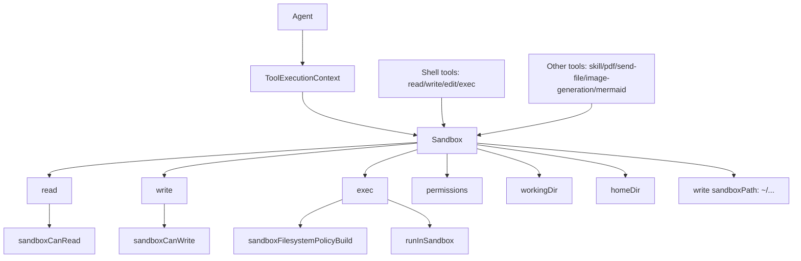

# Sandbox Abstraction

## Summary

A new `Sandbox` class is now the shared I/O boundary for agent tool execution.

It owns:
- secure file reads
- secure file writes
- sandbox-runtime command execution

Shell tools now format LLM-facing responses while delegating all I/O to `Sandbox`.

## Flow

## Notes

- `ToolExecutionContext` now carries `sandbox` as the primary I/O surface.
- `ToolExecutionContext.permissions` and `ToolExecutionContext.fileStore` were removed.
- `Agent` constructs one `Sandbox` instance and reuses it across tool calls.
- Exec no longer accepts user-provided `home`; `Sandbox` controls HOME via `homeDir`.
- File-producing tools now write directly into `~/downloads` via `sandbox.write()`.
