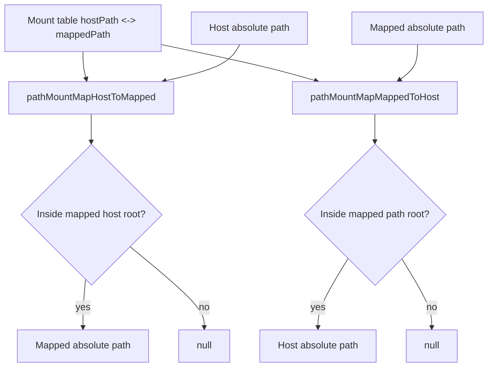

# Sandbox Nullable Path Mapping

Added generic mount-point path mapping utilities:

- `pathMountMapHostToMapped()`
- `pathMountMapMappedToHost()`

These take a mount table and map paths in both directions. They return `null` when input is relative or outside all mounts.

Sandbox-specific strict helpers are thin adapters and also return `null` when unmappable:

- `sandboxPathHostToContainerMap()`
- `sandboxPathContainerToHostMap()`

Implementation files (generic):

- `packages/daycare/sources/util/pathMountMapHostToMapped.ts`
- `packages/daycare/sources/util/pathMountMapMappedToHost.ts`
- `packages/daycare/sources/util/pathMountTypes.ts`

Implementation files (sandbox adapters):

- `packages/daycare/sources/sandbox/sandboxPathHostToContainerMap.ts`
- `packages/daycare/sources/sandbox/sandboxPathContainerToHostMap.ts`

These helpers map only known mount prefixes:

- host home `<hostHomeDir>` <-> container `/home`
- host skills `<hostSkillsActiveDir>` <-> container `/shared/skills`
- host examples `<hostExamplesDir>` <-> container `/shared/examples`

Existing compatibility helpers continue to return the original input when unmappable and now delegate to the new strict mappers.

