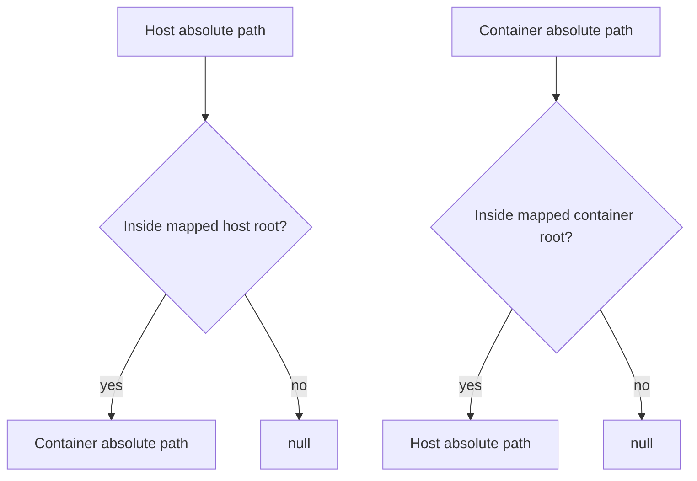

# Sandbox Nullable Path Mapping

Added strict docker remap helpers that return `null` when a path is not in a mapped mount root:

- `sandboxPathHostToContainerMap()`
- `sandboxPathContainerToHostMap()`

Implementation files:

- `packages/daycare/sources/util/sandboxPathHostToContainerMap.ts`
- `packages/daycare/sources/util/sandboxPathContainerToHostMap.ts`

These helpers map only known mount prefixes:

- host home `<hostHomeDir>` <-> container `/home`
- host skills `<hostSkillsActiveDir>` <-> container `/shared/skills`
- host examples `<hostExamplesDir>` <-> container `/shared/examples`

Existing compatibility helpers continue to return the original input when unmappable and now delegate to the new strict mappers.

