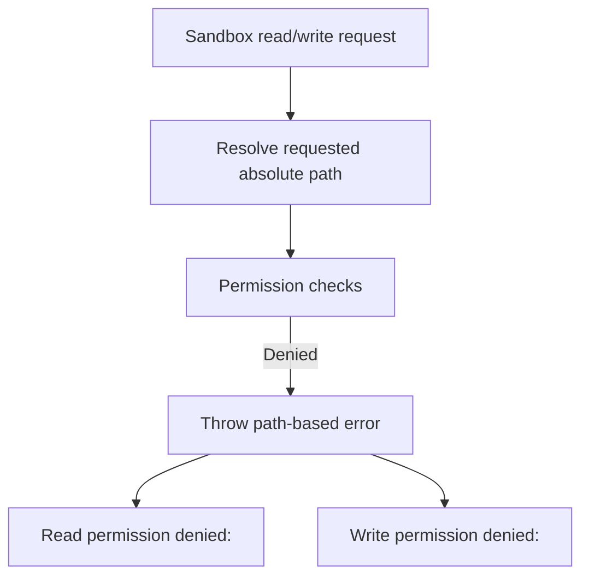

# Sandbox permission error paths

Read/write permission denials now report the rejected path directly, without exposing internal reason details.

```mermaid
flowchart TD
    A[Sandbox read/write request] --> B[Resolve requested absolute path]
    B --> C[Permission checks]
    C -->|Denied| D[Throw path-based error]
    D --> E["Read permission denied: <path>"]
    D --> F["Write permission denied: <path>"]
```
