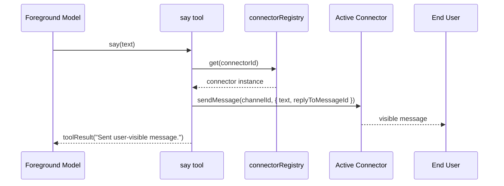

# Foreground `say` Tool

Adds a dedicated `say` tool for foreground user agents so model output can be delivered immediately without relying on `<say>...</say>` text wrapping.

## Runtime Flow

## Prompt Guidance

- Foreground tool-calling guidance now tells the model to prefer `say` when available.
- Foreground no-tools (`<run_python>`) guidance now also states that `say(...)` is preferred for user-visible output.
- `<say>...</say>` behavior remains as a fallback path.
