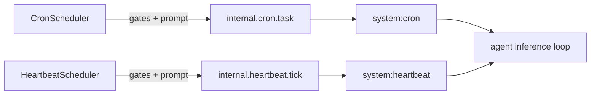

# Scheduler Signal Workers

## Summary

Cron and heartbeat schedulers now deliver work to worker agents as internal signal events instead of posting direct message items.

- Cron tasks emit `internal.cron.task` to the `system:cron` worker.
- Heartbeat batches emit `internal.heartbeat.tick` to the `system:heartbeat` worker.
- Agent signal handling accepts these internal scheduler patterns without requiring persisted user subscriptions.

## Flow

