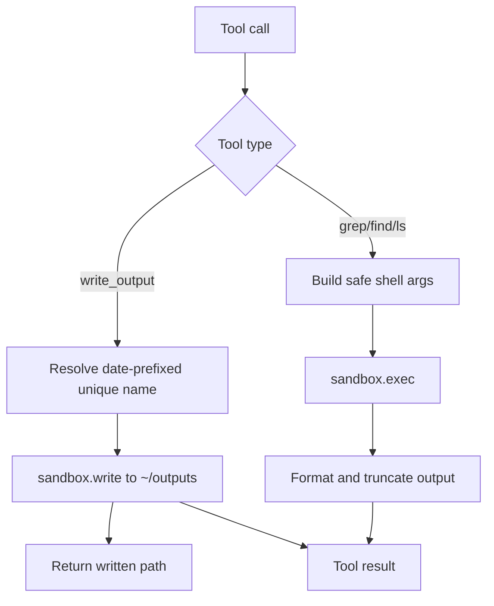

# Shell Filesystem Tools

The shell plugin now exposes four filesystem-oriented tools in addition to `read`/`write`/`edit`/`exec`:

- `write_output`
- `grep`
- `find`
- `ls`

`grep`, `find`, and `ls` execute system binaries through `sandbox.exec()` and keep output bounded for prompt safety.
`write_output` writes markdown or json files into `~/outputs` with date-prefixed collision-safe naming (`YYYYMMDDHHMMSS-name.md`). Returns the unique path — always print it.

