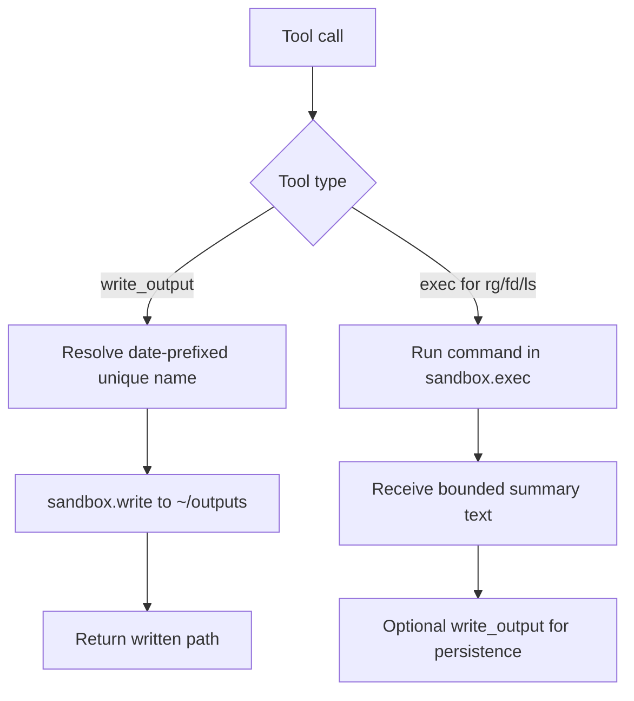

# Shell Filesystem Tools

The shell plugin exposes `write_output` as the dedicated filesystem helper in addition to `read`/`write`/`edit`/`exec`.

- `write_output`

`grep`, `find`, and `ls` are intentionally disabled. Use `exec` for search/list shell commands (`rg`, `fd`, `ls`) and
persist large results with `write_output`.
`write_output` writes markdown or json files into `~/outputs` with date-prefixed collision-safe naming (`YYYYMMDDHHMMSS-name.md`). Returns the unique path — always print it.

Legacy helper behavior (if re-enabled):
- `grep`, `find`, and `ls` normalize `~`/`~/...` before shell quoting, so home paths behave consistently.
- In Docker mode, `~` normalizes to `/home/...`; in host mode, it normalizes to the sandbox host home path.

