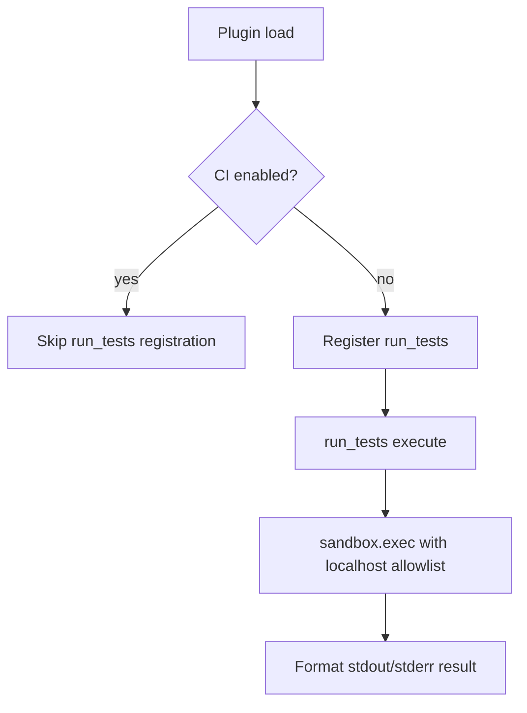

# Shell Run Tests Tool

The shell plugin includes a `run_tests` tool that executes tests inside the sandboxed workspace.

- Default command: `yarn test`
- Optional overrides: `command`, `cwd`, `timeoutMs`
- CI guard: the tool is not registered when `CI` is enabled and also rejects direct execution in CI.

