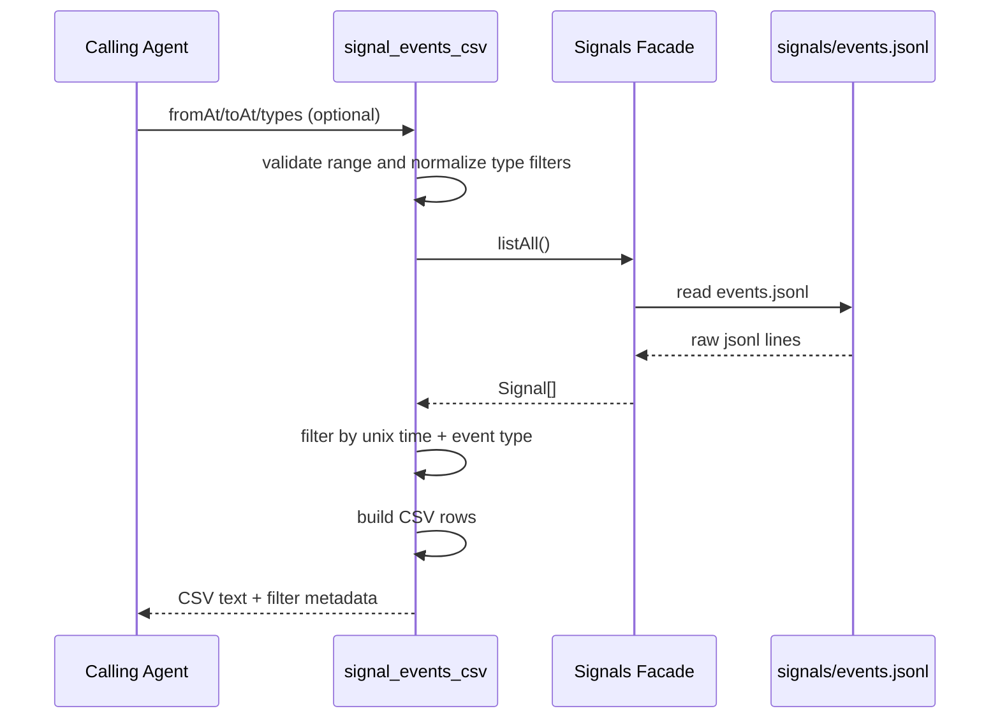

# Signal Events CSV Tool

`signal_events_csv` reads persisted signal events and returns CSV for downstream analysis.

- `fromAt`: optional lower bound (inclusive), unix milliseconds
- `toAt`: optional upper bound (inclusive), unix milliseconds
- `types`: optional list of exact signal event types
- when both `fromAt` and `toAt` are provided, `fromAt` must be `<= toAt`
- output columns are always:
  - `event_type`
  - `args` (JSON string for the signal `data` payload, `null` when absent)
  - `unix_time`
  - `ai_friendly_time` (ISO-8601 timestamp)

