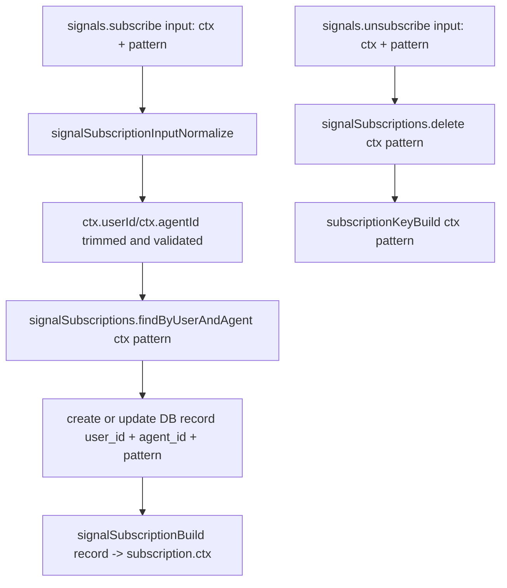

# Signal Subscription Context Normalization

## Summary
Signal subscription APIs now use `ctx` for identity inputs and outputs:
- `SignalSubscribeInput` and `SignalUnsubscribeInput` accept `{ ctx, pattern }`.
- `SignalSubscription` exposes `{ ctx, pattern, silent, createdAt, updatedAt }`.
- Repository keying helpers build keys from `ctx` instead of separate `userId` / `agentId` params.

## Behavior
- `signals.subscribe({ ctx, pattern, silent })` normalizes `ctx.userId` and `ctx.agentId` before persistence.
- `signals.subscriptionGet({ ctx, pattern })` and `signals.unsubscribe({ ctx, pattern })` use the same normalized key path.
- `signalSubscriptionBuild(record)` maps DB fields to `subscription.ctx`.
- `signalSubscriptionsRepository.subscriptionKeyBuild(ctx, pattern)` is the canonical key builder.

## Flow

