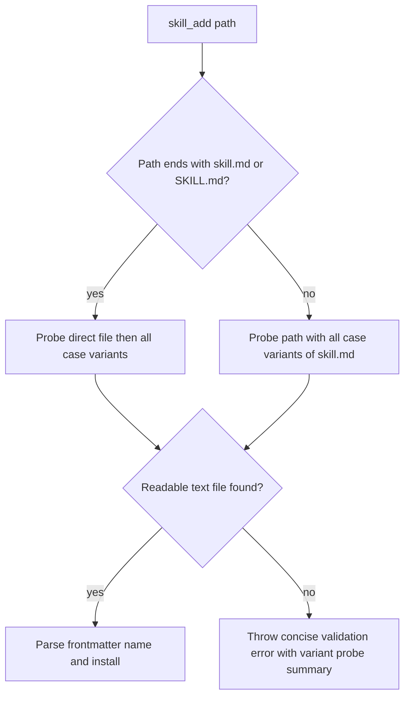

# skill_add local folder fallback

## Summary
- `skill_add` accepts either a directory path or a direct skill file path.
- The resolver probes `skill.md` case-insensitively (`skill.md`, `SKILL.md`, `sKiLl.Md`, etc.) via `sandbox.read`.
- Failures summarize probe behavior; when all variants are missing it returns a concise "tried N variants" message.

## Resolution flow

