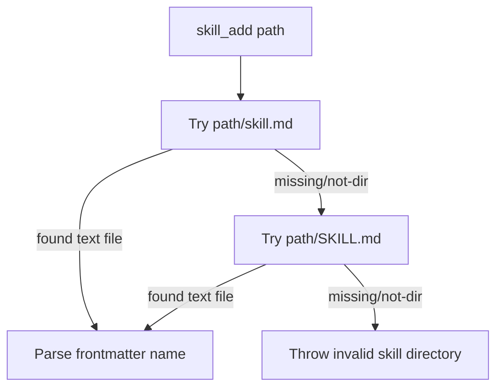

# skill_add local folder fallback

## Summary
- `skill_add` now accepts local skill folders that contain either `skill.md` or `SKILL.md`.
- The tool still validates via `sandbox.read` and keeps the same external error message when no valid skill file exists.

## Resolution flow

