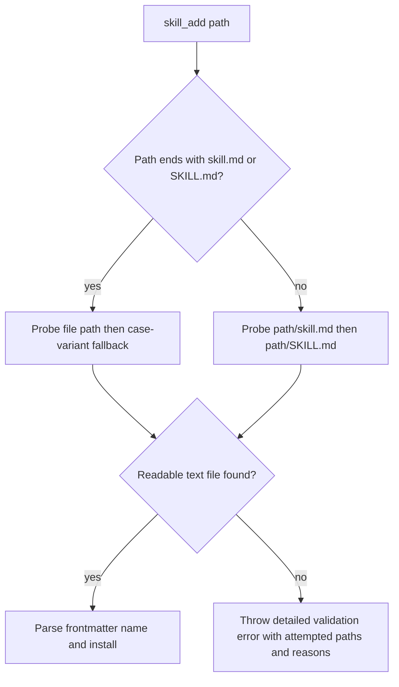

# skill_add local folder fallback

## Summary
- `skill_add` accepts either a directory path or a direct skill file path.
- The resolver probes both `skill.md` and `SKILL.md` via `sandbox.read`.
- Failures now return a detailed summary that includes each attempted path and reason.

## Resolution flow

